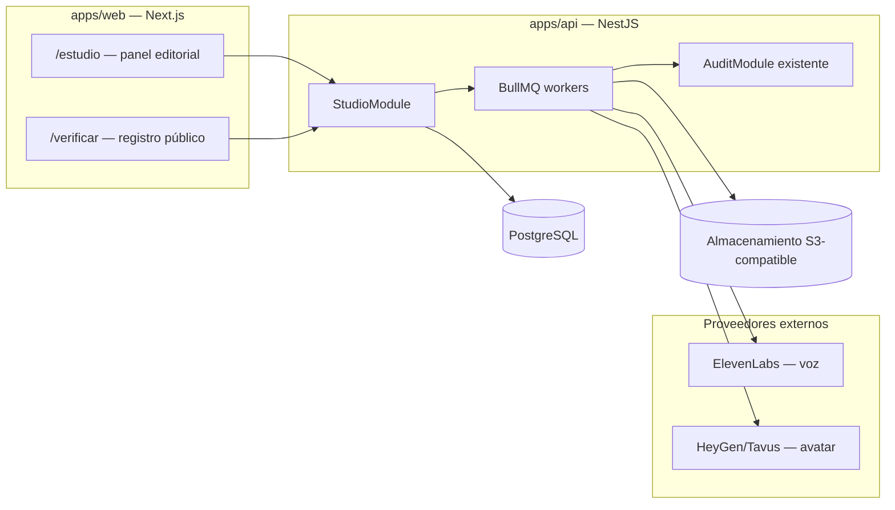
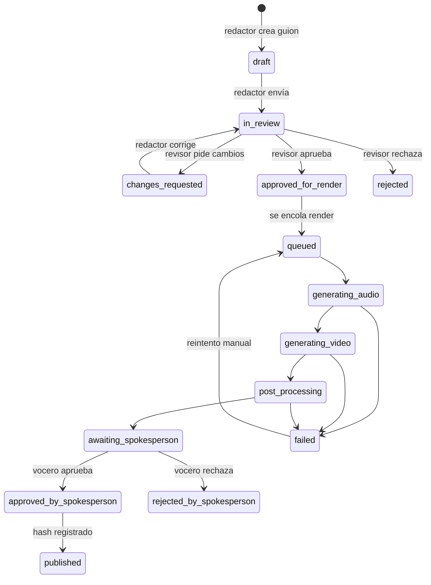

# ESTUDIO-VIDEO.md — Módulo de Estudio de Video con Clones Digitales

> Documento de diseño consolidado del módulo **Estudio** para Renacer Democrático.
> Autocontenido: cualquier desarrollador — o una sesión de Claude Code abierta en VS Code —
> puede implementar el módulo leyendo únicamente este documento y el código existente del monorepo.
>
> **Decisión de respaldo:** ADR-017 en `docs/DECISIONS.md` (estado: Propuesto).
> **Fecha:** 2026-08-05

---

## 1. Objetivo

Permitir que los voceros de Renacer Democrático produzcan videos de comunicación política
a escala (varias piezas por semana) usando **clones digitales consentidos** (voz clonada +
avatar visual de la persona real), con:

- un pipeline de *guion → voz → video → formatos por plataforma → publicación* que tome minutos, no días;
- un flujo de aprobación editorial donde **nada se publica sin la aprobación de la persona clonada**;
- transparencia obligatoria (divulgación de IA) y un **registro público de hashes** que permita
  a cualquiera verificar si un video que circula es auténtico.

### No-objetivos (fuera de alcance del MVP)

- Clonación de terceros o personas sin consentimiento documentado — **prohibido por diseño**, no solo fuera de alcance.
- Edición avanzada de video (timeline, multicámara).
- Modelos autoalojados (Ruta B del ADR-017) — la arquitectura los permite a futuro, no se implementan ahora.
- Publicación automática en redes (el MVP genera y registra; publicar es manual con checklist).

---

## 2. Contexto y restricciones vinculantes (resumen del ADR-017)

| # | Restricción | Implicación en código |
|---|---|---|
| 1 | Proveedores tras interfaz propia | `AvatarProvider` y `VoiceProvider` como interfaces TS; HeyGen/ElevenLabs son implementaciones intercambiables |
| 2 | Consentimiento explícito y revocable | Modelo `SpokespersonConsent`; revocar desactiva el clon y dispara eliminación ante el proveedor |
| 3 | Assets biométricos = secretos | IDs de avatar/voz del proveedor cifrados en BD; ningún media biométrico en el repo; toda generación auditada |
| 4 | Aprobación editorial en cadena | Máquina de estados (§6); el vocero clonado siempre es el último aprobador |
| 5 | Divulgación de IA obligatoria | Overlay "Video generado con IA" quemado en el render final (post-producción, §8) |
| 6 | Registro público verificable | Hash SHA-256 de cada video publicado, expuesto en endpoint y página públicos (§10) |
| 7 | Piloto con un solo vocero | Iteración E1–E4 con un vocero antes de onboardear al resto (§13) |

Los principios generales del repo (Claude.md) aplican: seguridad primero, módulos auditables,
sin secretos en el repositorio, tests en lo crítico, documentar decisiones.

---

## 3. Arquitectura general

El módulo se integra en las apps existentes del monorepo — **no** se crea una app nueva.
Reutiliza autenticación, RBAC, auditoría, Prisma, Redis y el patrón de módulos NestJS ya establecidos.



### Componentes nuevos

| Componente | Ubicación | Descripción |
|---|---|---|
| `StudioModule` | `apps/api/src/studio/` | Controladores, servicios, DTOs, máquina de estados |
| Workers BullMQ | `apps/api/src/studio/workers/` | Jobs de voz, video, post-producción y registro |
| Panel editorial | `apps/web/app/estudio/` | Guiones, revisión, aprobación, biblioteca de videos |
| Página de verificación | `apps/web/app/verificar/` | Pública, sin login: buscar un video por hash |
| Tipos compartidos | `packages/shared/src/studio/` | Enums de estado, DTOs, tipos de la API pública |
| Storage S3 | servicio nuevo `StorageService` | MinIO en el VPS (docker-compose) o S3/R2 gestionado |

### Dependencias de infraestructura nuevas

- **BullMQ** (`bullmq`) sobre el Redis existente — primera adopción real de la cola ya planificada.
- **ffmpeg** en la imagen Docker del API (post-producción: subtítulos, overlay de IA, formatos).
- **MinIO** (o S3/R2 externo) para almacenar audios y videos — los binarios nunca van a PostgreSQL.

---

## 4. Roles y permisos

Se añaden roles funcionales del estudio, ortogonales al `AccountStatus` existente:

| Rol | Permisos |
|---|---|
| `studio_writer` (redactor) | Crear/editar guiones en borrador, enviar a revisión |
| `studio_reviewer` (revisor) | Aprobar/rechazar guiones en revisión, editar con comentarios |
| `studio_spokesperson` (vocero) | Aprobación final de videos con **su** avatar; gestionar su consentimiento |
| `studio_admin` | Gestionar voceros, ver auditoría del estudio, configurar proveedores |

Reglas duras (guards de NestJS, con tests):

1. Un vocero solo puede aprobar/rechazar renders de **su propio** avatar.
2. Nadie —ni `studio_admin`— puede publicar un video sin el estado `approved_by_spokesperson`.
3. Revocado el consentimiento, ningún job nuevo puede usar ese clon (validación en el servicio **y** en el worker).

---

## 5. Modelo de datos (Prisma)

Añadir a `apps/api/prisma/schema.prisma`, siguiendo las convenciones existentes
(UUID, `@db.Timestamptz`, `@@map` snake_case, comentarios en español):

```prisma
enum ConsentStatus {
  active
  revoked
}

enum ScriptStatus {
  draft                    // Redactor escribiendo
  in_review                // Enviado a revisor
  changes_requested        // Revisor pidió cambios
  approved_for_render      // Revisor aprobó; puede generarse el video
  rejected                 // Rechazado definitivamente
}

enum RenderStatus {
  queued                   // En cola BullMQ
  generating_audio         // ElevenLabs en curso
  generating_video         // HeyGen/Tavus en curso
  post_processing          // ffmpeg: subtítulos, overlay IA, formatos
  awaiting_spokesperson    // Esperando aprobación final del vocero
  approved_by_spokesperson // Vocero aprobó; puede publicarse
  published                // Publicado y registrado (hash en registro público)
  rejected_by_spokesperson // Vocero rechazó el render
  failed                   // Error técnico (reintentable)
}

/**
 * Spokesperson — vocero con clon digital.
 *
 * Los IDs del proveedor (avatar y voz) son datos sensibles:
 * se almacenan cifrados con AES-256-GCM (clave en env STUDIO_ASSET_KEY).
 * Esta tabla NUNCA contiene media biométrico, solo referencias cifradas.
 */
model Spokesperson {
  id                  String   @id @default(uuid()) @db.Uuid
  profileId           String   @unique @db.Uuid

  displayName         String   // Nombre público como aparece en los videos
  title               String?  // Cargo dentro de Renacer Democrático

  providerAvatarIdEnc String?  // ID de avatar en HeyGen/Tavus, cifrado
  providerVoiceIdEnc  String?  // ID de voz en ElevenLabs, cifrado

  isActive            Boolean  @default(false) // Solo true con consentimiento activo y clon listo

  createdAt           DateTime @default(now()) @db.Timestamptz
  updatedAt           DateTime @updatedAt @db.Timestamptz

  consents            SpokespersonConsent[]
  scripts             VideoScript[]

  @@map("spokespersons")
}

/**
 * SpokespersonConsent — consentimiento explícito y revocable (ADR-017 §2).
 * Append-only: la revocación crea un registro nuevo, no edita el anterior.
 */
model SpokespersonConsent {
  id              String        @id @default(uuid()) @db.Uuid
  spokespersonId  String        @db.Uuid
  spokesperson    Spokesperson  @relation(fields: [spokespersonId], references: [id])

  status          ConsentStatus
  documentHash    String        // SHA-256 del documento de consentimiento firmado
  acceptsRisks    Boolean       // Aceptó explícitamente el riesgo de proveedores en EE.UU.
  grantedAt       DateTime      @default(now()) @db.Timestamptz
  revokedAt       DateTime?     @db.Timestamptz
  revokedReason   String?

  @@index([spokespersonId, status])
  @@map("spokesperson_consents")
}

/**
 * VideoScript — guion de un video, con flujo editorial.
 */
model VideoScript {
  id              String        @id @default(uuid()) @db.Uuid
  spokespersonId  String        @db.Uuid
  spokesperson    Spokesperson  @relation(fields: [spokespersonId], references: [id])

  authorProfileId String        @db.Uuid   // Redactor
  title           String
  body            String                   // Texto que dirá el avatar
  notes           String?                  // Indicaciones de tono/contexto

  status          ScriptStatus  @default(draft)
  reviewComment   String?                  // Último comentario del revisor

  createdAt       DateTime      @default(now()) @db.Timestamptz
  updatedAt       DateTime      @updatedAt @db.Timestamptz

  renders         VideoRender[]

  @@index([status])
  @@index([spokespersonId])
  @@map("video_scripts")
}

/**
 * VideoRender — una generación concreta de un guion aprobado.
 * Un guion puede tener varios renders (reintentos, regeneraciones).
 */
model VideoRender {
  id               String       @id @default(uuid()) @db.Uuid
  scriptId         String       @db.Uuid
  script           VideoScript  @relation(fields: [scriptId], references: [id])

  status           RenderStatus @default(queued)
  failureReason    String?

  // Referencias a jobs del proveedor (para polling/webhooks)
  providerAudioJob String?
  providerVideoJob String?

  // Claves de objetos en el storage S3 (no URLs públicas)
  audioKey         String?
  masterKey        String?      // Video master 16:9 con overlay de IA
  verticalKey      String?      // Variante 9:16 (TikTok/Reels/Shorts/WhatsApp)
  subtitlesKey     String?      // .srt generado

  // Verificación pública (solo cuando status = published)
  sha256           String?      @unique // Hash del master publicado
  publishedAt      DateTime?    @db.Timestamptz

  approvedByProfileId String?   @db.Uuid  // Perfil del vocero que aprobó
  approvedAt          DateTime? @db.Timestamptz

  createdAt        DateTime     @default(now()) @db.Timestamptz
  updatedAt        DateTime     @updatedAt @db.Timestamptz

  @@index([status])
  @@index([scriptId])
  @@map("video_renders")
}
```

**Auditoría:** cada transición de estado emite un `AuditEvent` con el `AuditModule` existente.
Acciones: `studio.consent.granted`, `studio.consent.revoked`, `studio.script.submitted`,
`studio.script.approved`, `studio.render.queued`, `studio.render.approved`,
`studio.render.rejected`, `studio.render.published`.

---

## 6. Máquina de estados editorial



Las transiciones válidas se centralizan en un único mapa
(`studio/state-machine.ts`) con test exhaustivo — mismo patrón que la lógica
Schulze en `voting/schulze.ts`: lógica pura, separada del framework, 100% testeada.

---

## 7. Abstracción de proveedores

En `apps/api/src/studio/providers/`:

```typescript
// voice-provider.interface.ts
export interface VoiceProvider {
  /** Genera audio TTS con la voz clonada. Devuelve un job id del proveedor. */
  synthesize(voiceId: string, text: string): Promise<{ providerJobId: string }>;
  /** Consulta estado; si terminó, devuelve el audio como stream/buffer. */
  fetchResult(providerJobId: string): Promise<VoiceResult>;
  /** Elimina la voz clonada ante el proveedor (revocación de consentimiento). */
  deleteVoice(voiceId: string): Promise<void>;
}

// avatar-provider.interface.ts
export interface AvatarProvider {
  /** Genera el video del avatar sincronizado con el audio dado. */
  render(avatarId: string, audioUrl: string): Promise<{ providerJobId: string }>;
  fetchResult(providerJobId: string): Promise<AvatarResult>;
  /** Elimina el avatar ante el proveedor (revocación de consentimiento). */
  deleteAvatar(avatarId: string): Promise<void>;
}
```

Implementaciones del MVP: `ElevenLabsVoiceProvider`, `HeyGenAvatarProvider`.
Se registran como providers de NestJS contra el token de la interfaz, igual que
`EmailService` abstrae Resend — cambiar de proveedor toca solo la implementación.
La futura Ruta B (autoalojado) es otra implementación de las mismas interfaces.

**Reglas:**
- Los IDs de avatar/voz se descifran solo en memoria del worker, nunca se loguean.
- `deleteVoice`/`deleteAvatar` se invocan al revocar consentimiento; el resultado
  (éxito o fallo del proveedor) queda en auditoría.

---

## 8. Pipeline de generación (BullMQ)

Cola `studio-render`, en `apps/api/src/studio/workers/`. Un flujo por render:

| Paso | Job | Hace | Reintentos |
|---|---|---|---|
| 1 | `generate-audio` | Valida consentimiento activo → ElevenLabs TTS → guarda audio en S3 (`audioKey`) | 3, backoff exponencial |
| 2 | `generate-video` | HeyGen render con el audio → descarga master crudo a S3 | 3 |
| 3 | `post-process` | ffmpeg: (a) quema overlay "Video generado con IA — Renacer Democrático"; (b) genera subtítulos (Whisper API o el .srt del proveedor); (c) exporta master 16:9 y vertical 9:16 | 2 |
| 4 | `finalize` | Calcula SHA-256 del master → estado `awaiting_spokesperson` → notifica al vocero por email (EmailService existente) | 3 |

La publicación (tras aprobación del vocero) es una acción síncrona del servicio:
persiste `sha256` + `publishedAt`, emite `studio.render.published` en auditoría
y el video aparece en el registro público. **El hash se calcula sobre el archivo
master exacto que se distribuye** — si se re-renderiza, es un render nuevo con hash nuevo.

Progreso visible: el panel hace polling a `GET /studio/renders/:id` (sin websockets en el MVP).

---

## 9. API (endpoints del StudioModule)

Autenticados (guards por rol según §4), prefijo `/studio`:

| Método y ruta | Rol | Descripción |
|---|---|---|
| `POST /studio/scripts` | writer | Crear guion (borrador) |
| `PATCH /studio/scripts/:id` | writer | Editar borrador / corregir tras cambios pedidos |
| `POST /studio/scripts/:id/submit` | writer | Enviar a revisión |
| `POST /studio/scripts/:id/review` | reviewer | Aprobar, pedir cambios o rechazar (body: decisión + comentario) |
| `POST /studio/scripts/:id/render` | reviewer | Encolar render de un guion aprobado |
| `GET /studio/renders/:id` | cualquiera del estudio | Estado del render (para polling) |
| `POST /studio/renders/:id/decision` | spokesperson (dueño del avatar) | Aprobar o rechazar el render final |
| `POST /studio/renders/:id/publish` | admin o spokesperson | Publicar un render aprobado |
| `GET /studio/scripts` / `GET /studio/renders` | según rol | Listados con filtros por estado |
| `POST /studio/spokespersons/:id/revoke-consent` | spokesperson (self) o admin | Revocar consentimiento |

Públicos, sin autenticación, con rate limiting (Redis existente):

| Método y ruta | Descripción |
|---|---|
| `GET /public/videos` | Registro público: lista de videos oficiales publicados (título, vocero, fecha, sha256) |
| `GET /public/videos/verify/:sha256` | Verificación: ¿existe un video oficial con este hash? |

---

## 10. Frontend (apps/web)

### Panel editorial `/estudio` (autenticado, por rol)

- **Guiones**: lista con filtro por estado; editor de guion con contador de duración estimada (~150 palabras/min).
- **Revisión**: cola del revisor con aprobar / pedir cambios / rechazar.
- **Mis aprobaciones** (vocero): renders `awaiting_spokesperson` con reproductor y botones aprobar/rechazar.
- **Biblioteca**: videos publicados con enlaces de descarga por formato y su hash.

### Página pública `/verificar`

- Lista de videos oficiales publicados.
- Campo para pegar un hash SHA-256 (o subir un archivo — el hash se calcula **en el navegador** con
  `crypto.subtle.digest`; el archivo nunca se sube al servidor) → respuesta clara:
  **"✔ Video oficial de Renacer Democrático"** o **"✘ No está en el registro — no fue publicado por nosotros"**.
- Instrucciones en lenguaje simple para no técnicos.

---

## 11. Seguridad (resumen operativo)

1. **Secretos** solo en variables de entorno (§12); nada en el repo. Los IDs biométricos
   del proveedor van cifrados en BD (AES-256-GCM, `STUDIO_ASSET_KEY`).
2. **Media** en bucket S3 privado; el frontend accede vía URLs firmadas de corta duración.
3. **Auditoría append-only** de toda acción del estudio (acciones listadas en §5).
4. **Rate limiting** en endpoints públicos de verificación.
5. **Validación de consentimiento en dos capas**: el servicio al encolar y el worker antes
   de llamar al proveedor (defensa contra jobs encolados antes de una revocación).
6. Al entrar en desarrollo, **actualizar `docs/SECURITY.md`** con el modelo de amenazas
   de clones (obligación del ADR-017).

## 12. Variables de entorno (añadir a `.env.example`)

```bash
# ─── Estudio de video (módulo Studio) ────────────────────────────
ELEVENLABS_API_KEY=            # Voz clonada (TTS)
HEYGEN_API_KEY=                # Avatar visual
STUDIO_ASSET_KEY=              # AES-256-GCM para cifrar IDs biométricos en BD (32 bytes, base64)
STUDIO_WHISPER_API_KEY=        # Opcional: subtítulos si el proveedor no los entrega

# Storage S3-compatible (MinIO local o R2/S3)
S3_ENDPOINT=
S3_BUCKET=decide-studio
S3_ACCESS_KEY=
S3_SECRET_KEY=
```

---

## 13. Plan de implementación por iteraciones

Cada iteración termina con tests pasando, lint limpio y commit. Seguir el formato de
respuesta de Claude.md (objetivo → archivos → implementación → tests → resumen → riesgos → siguiente paso).

| It. | Entregable | Criterio de aceptación |
|---|---|---|
| **E1** | Migración Prisma (§5) + `StudioModule` esqueleto + máquina de estados pura con tests | `state-machine.spec.ts` cubre todas las transiciones válidas e inválidas |
| **E2** | CRUD de guiones + flujo editorial + guards de rol + auditoría | Un guion recorre draft→in_review→approved_for_render solo con los roles correctos |
| **E3** | Interfaces de proveedor + implementaciones HeyGen/ElevenLabs + `StorageService` + workers BullMQ (mock de proveedores en tests) | Pipeline completo en test de integración con proveedores mockeados |
| **E4** | Post-producción ffmpeg (overlay IA, subtítulos, 9:16) + aprobación del vocero + publicación con hash | Video master publicado tiene overlay visible y sha256 registrado |
| **E5** | Panel `/estudio` en Next.js | Un redactor, un revisor y un vocero completan el flujo desde el navegador |
| **E6** | Página pública `/verificar` + endpoints públicos con rate limiting | Verificación por hash funciona con archivo local (hash en navegador) |
| **E7** | **Piloto real**: onboarding del primer vocero (consentimiento, grabación, clon) y primer video publicado | Video real aprobado y verificable públicamente; ADR-017 pasa a "Aceptado" |

Onboardear al resto de voceros **solo después** de evaluar el piloto (calidad de español,
acento nicaragüense, recepción de la audiencia).

### Riesgos conocidos

- **Acento/naturalidad en español**: ElevenLabs es fuerte en español pero el acento nica debe
  validarse en E7 antes de escalar; es la razón de ser del piloto.
- **Webhooks vs polling de proveedores**: el MVP usa polling desde los workers (más simple en el
  VPS); migrar a webhooks si el volumen lo pide.
- **Costo**: HeyGen + ElevenLabs ≈ decenas–pocos cientos USD/mes según minutos; revisar
  mensualmente contra el umbral de migración a Ruta B (ADR-017).

---

## 14. Guía rápida para Claude Code (VS Code)

Contexto mínimo para retomar este trabajo en una sesión nueva:

1. Leer `Claude.md` (reglas del repo), este documento y el ADR-017 en `docs/DECISIONS.md`.
2. Referencias de patrón en el código existente:
   - Módulo NestJS por dominio: `apps/api/src/voting/` (lógica pura + servicio + controller + specs).
   - Auditoría: `apps/api/src/audit/audit.service.ts` — usarlo, no reimplementarlo.
   - Abstracción de proveedor: `apps/api/src/email/email.service.ts` (patrón Resend).
   - Convenciones Prisma: `apps/api/prisma/schema.prisma` (UUID, Timestamptz, @@map snake_case).
3. Comandos: `pnpm install` · `turbo run build` · `turbo run test` · migraciones con
   `pnpm --filter api exec prisma migrate dev`.
4. Implementar en el orden de iteraciones de §13 — una iteración por sesión/PR es el tamaño correcto.
5. Nunca commitear claves, media biométrico ni datos reales de voceros.
