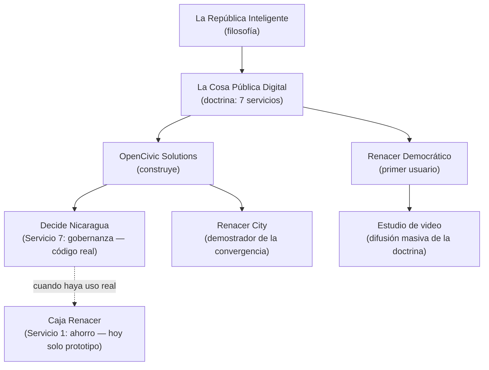

# VISION.md — Mapa del ecosistema y foco estratégico

> Ordena el cuerpo de ideas del proyecto — filosofía, doctrina, vehículos y ejecución —
> y define dónde está el foco. Referencia para cualquier colaborador o sesión de Claude Code
> que necesite entender cómo encaja este repositorio en la visión completa.
>
> Fuentes: *La República Inteligente* y *La Cosa Pública Digital* (Carlos Robleto,
> OpenCivic Solutions), prototipo Renacer City (`docs/prototypes/renacer-city.html`),
> plataforma Decide Nicaragua (este repositorio) y diseño del Estudio de video
> (`docs/ESTUDIO-VIDEO.md`).
>
> **Fecha:** 2026-08-05

---

## 1. La pirámide: seis piezas, cuatro niveles

| Nivel | Pieza | Naturaleza | Estado |
|---|---|---|---|
| **1. Filosofía** — el porqué | *La República Inteligente* | Manifiesto: la revolución de la confianza, el tiempo como riqueza fundamental, democracia verificable, democracia líquida, IA y blockchain al servicio de la dignidad | Escrito |
| **2. Doctrina** — el qué | *La Cosa Pública Digital* | Programa institucional: Estado de bienestar modular, portable y replicable, organizado como cooperativa pública con 7 servicios | Escrito; **documento maestro operativo** |
| **3. Vehículos** — el quién | OpenCivic Solutions · Renacer Democrático | Organización cívico-técnica (construye infraestructura abierta) · movimiento político (primer usuario de esa infraestructura) | Activos |
| **4. Ejecución** — el cómo | Decide Nicaragua · Renacer City · Estudio de video | Plataforma real (MVP, Fases 0–7, 155 tests) · demostrador narrativo · canal de difusión (diseñado en ESTUDIO-VIDEO.md) | En marcha |

### Cómo se subordinan las piezas

- **La República Inteligente** es el prólogo filosófico de La Cosa Pública Digital.
- **La Cosa Pública Digital** define los 7 servicios: (1) ahorro e inversión, (2) identidad
  digital, (3) asistencia legal, (4) salud, (5) educación, (6) criptografía y ciberseguridad,
  (7) gobernanza pública verificable.
- **Decide Nicaragua** (este repo) es la implementación real del **Servicio 7** —
  y de nada más, deliberadamente.
- **Renacer City** es la maqueta de cómo se verá la convergencia de los servicios;
  su análisis de brechas frente al código real está en la conversación de diseño y
  se resume en §4.
- **El Estudio de video** (ADR-017, `ESTUDIO-VIDEO.md`) es el canal para masificar
  la doctrina con los voceros de Renacer Democrático.

---

## 2. Dos tensiones estratégicas (a resolver, no ignorar)

### 2.1 Movimiento político vs. infraestructura cívica

Renacer Democrático es partidista. Decide Nicaragua y la Cosa Pública Digital se
legitiman siendo **neutrales, auditables y replicables**. Una plataforma de votación
percibida como propiedad de un partido pierde su activo principal: la confianza.

**Resolución adoptada:** separación explícita de roles.
- OpenCivic Solutions construye infraestructura abierta que cualquiera puede auditar,
  replicar y usar (principio 8 de la doctrina: la replicabilidad es un deber).
- Renacer Democrático es el **primer usuario** de esa infraestructura, no su dueño.
- En la práctica: el código es libre, la documentación pública, y ninguna regla de la
  plataforma puede favorecer estructuralmente a una corriente política.

### 2.2 Proliferación de marcas

Siete nombres (República Inteligente, Cosa Pública Digital, Hash Republic Protocol,
OpenCivic, Renacer City, Renacer Democrático, Decide Nicaragua) dispersan un mensaje
que se quiere masificar.

**Convención adoptada:** tres marcas activas —
una organización (**OpenCivic Solutions**), una doctrina (**La Cosa Pública Digital**,
con La República Inteligente como prólogo), un producto (**Decide Nicaragua**).
Renacer City queda como nombre del demostrador; Hash Republic Protocol como nombre
técnico interno del protocolo, no como marca pública.

---

## 3. El foco (regla 80/20 de Claude.md)

De los 7 servicios de la doctrina, solo la gobernanza tiene código probado. Los demás
cargan tamaño y riesgo regulatorio/custodial. Orden de ejecución:

1. **Ahora (semanas):** desplegar Decide Nicaragua en el VPS y ponerla en manos de los
   primeros miembros reales — Iteraciones 8–10 del `ROADMAP.md` (deploy, endurecimiento,
   verificación independiente). Una comunidad de 100 personas decidiendo de verdad es el
   "Nivel 1: núcleo mínimo viable" de la propia doctrina, y vale más que seis servicios
   en papel.
2. **En paralelo (bajo costo):** publicar los dos ensayos y ejecutar el piloto del
   Estudio de video (iteraciones E1–E7 de `ESTUDIO-VIDEO.md`) — doctrina escrita +
   canal de difusión son la maquinaria de visibilización.
3. **Después:** segundo servicio solo cuando el primero tenga uso real. Candidato
   natural: **Caja Renacer** (Servicio 1) en versión mínima, ya prototipada en
   Renacer City. Requiere su propio ADR (custodia, regulación) antes de una línea
   de código.
4. **No ahora:** identidad soberana en blockchain, telemedicina, red legal
   cooperativa, DAOs y moneda de reputación — permanecen como doctrina hasta que
   exista comunidad activa que los legitime y los financie.

---

## 4. Brecha prototipo → plataforma (resumen)

Análisis completo hecho sobre el panel de Renacer City comparado con el código real:

| Concepto del prototipo | Estado en la plataforma | Prioridad |
|---|---|---|
| Votación Condorcet, sortition, auditoría append-only | ✅ Implementado y testeado | — |
| Quórum en votaciones | ❌ | Alta (barato, lógica en módulo `voting`) |
| Métricas públicas de "salud del sistema" | ⚠️ Datos existen, sin agregación | Alta (barato) |
| Verificación independiente sin confiar en el servidor | ⚠️ Parcial | Alta (Iteración 10 del roadmap) |
| Delegación líquida revocable con límite anti-concentración | ❌ | Media — primera capa nueva de gobernanza |
| Racimos de opinión (clustering estilo Pol.is) | ❌ | Media |
| Capa constitucional (artículos, objeciones, ratificación) | ❌ | Baja por ahora |
| Reputación y moneda de trabajo comunitario | ❌ | Requiere ADR político previo (riesgo de plutocracia) |
| Caja Renacer / tesorería Bitcoin | ❌ | Requiere ADR (custodia/regulación); primer candidato post-gobernanza |

---

## 5. Regla de decisión para nuevas ideas

Antes de incorporar cualquier idea nueva al desarrollo, pasa este filtro:

1. ¿A qué nivel de la pirámide pertenece (filosofía, doctrina, vehículo, ejecución)?
2. ¿Sirve al foco actual (gobernanza usada por miembros reales + difusión)?
   Si no: se documenta en la doctrina y espera.
3. ¿Compromete la neutralidad de la infraestructura frente al movimiento político?
   Si sí: se rediseña o se rechaza.
4. ¿Necesita ADR? (toda decisión con riesgo de seguridad, custodial, regulatorio
   o de legitimidad lo necesita).
